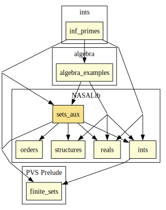

# Sets Aux

Power sets, orders, cardinality over infinite sets. Includes functional and relational facts based on Axiom of Choice and refinement relations based on equivalence relations.

## Highlights

### Major theorems

| Theorem | Location | PVS Name | Contributors |
| --- | --- | --- | --- |
|Denumerability of the Rational Numbers |`sets_aux@countable_set`|`countable_rat`| Jerry James |

# Contributors
* [Bruno Dutertre](http://www.csl.sri.com/users/bruno), SRI, USA
* [David Lester](http://apt.cs.man.ac.uk/people/dlester), Manchester University, UK
* Jerry James, Utah State University, USA
* Dragan Stosic, Ireland
* Jon Sjogren, Department of Defense, USA
* [Ricky Butler](http://shemesh.larc.nasa.gov/people/rwb), NASA, USA
* Anthony Narkawicz, NASA, USA
* [César Muñoz](http://shemesh.larc.nasa.gov/people/cam), NASA, USA
* [Sam Owre](http://www.csl.sri.com/users/owre), SRI, USA
* [Marco A. Feliú](https://www.nianet.org/directory/research-staff/marco-feliu/), NIA & NASA, USA
* [Mariano Moscato](https://www.nianet.org/directory/research-staff/mariano-moscato/), NIA & NASA, USA

## Maintainer
* [César Muñoz](http://shemesh.larc.nasa.gov/people/cam), NASA, USA

# Dependencies

