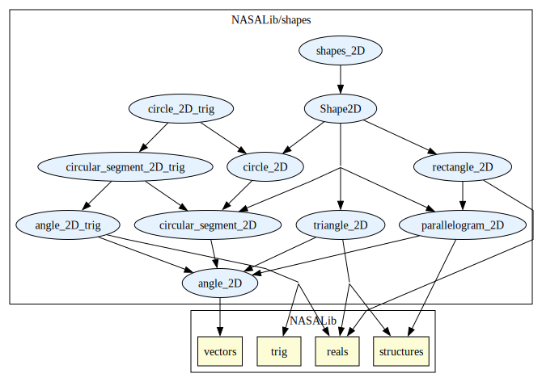
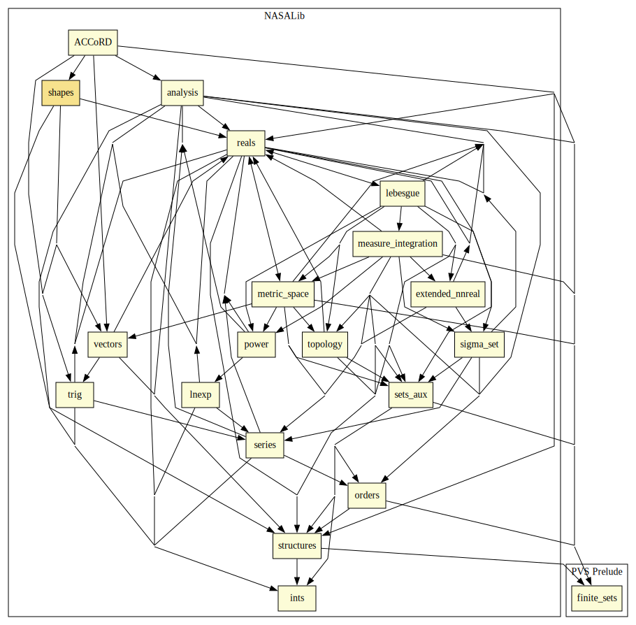

# Shapes

Library of 2-D shapes, including definitions of triangle, parallelogram, rectangle, circular_segment, and circle. All shapes have inclusive and exclusive definitions of point inclusion. 

# Contributors
* [César Muñoz](http://shemesh.larc.nasa.gov/people/cam), NASA, USA

## Maintainer
* [César Muñoz](http://shemesh.larc.nasa.gov/people/cam), NASA, USA

# Dependencies

