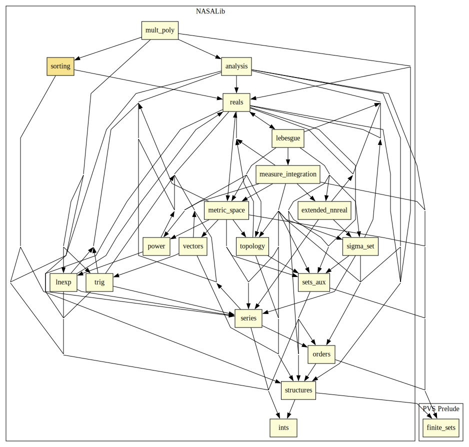

# Sorting

This library contains verifications of correctness and completeness of sorting algorithms. 
Course projects on Computational Logic for undergraduate computer science  students have been performed based on these libraries. 
Popular sorting algorithms as Bubble Sort, Quick Sort, Merge Sort, Insertion Sort and sorting by selection of minimum and switching are verified in this library.

## Highlights

### Major theorems

| Theorem | Location | PVS Name | Contributors |
| --- | --- | --- | --- |

# Contributors
* Thiago Mendonça Ferreira Ramos, University of Brasilia, Brazil
* Ariane Alves Almeida, University of Brasilia, Brazil
* Flavio L.C. de Moura, University of Brasilia, Brazil
* Ana Cristina Rocha Oliveira, University of Brasilia, Brazil
* [César Muñoz](http://shemesh.larc.nasa.gov/people/cam), NASA, USA
* [Mariano Moscato](https://www.nianet.org/directory/research-staff/mariano-moscato/), NIA & NASA, USA
* [Sam Owre](http://www.csl.sri.com/users/owre), SRI, USA

## Maintainer
* [César Muñoz](http://shemesh.larc.nasa.gov/people/cam), NASA, USA

# Dependencies

