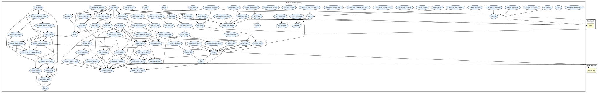

# Structures

This library provides definitions and properties on diverse data structures.

## Highlights

### Major theorems
| Theorem | Location | PVS Name | Contributors |
| --- | --- | --- | --- |
| Shroeder Bernstein | `structures@Shroeder_Bernstein` | `Shroeder_Bernstein` | J Tanner Slagel |

## Contributors
* [César Muñoz](http://shemesh.larc.nasa.gov/people/cam), NASA, USA
* David Griffioen,CWI, The Netherlands
* Kristin Rozier, formerly at NASA, USA
* Lee Pike, formely at NASA, USA
* Ricky Butler, formerly at NASA, USA
* Mariano Moscato, AMA @ NASA, USA
* [Aaron Dutle](http://shemesh.larc.nasa.gov/people/amd), NASA, USA
* Sam Owre, formerly at SRI, USA

## Maintainer
* [César Muñoz](http://shemesh.larc.nasa.gov/people/cam), NASA, USA

## External Dependencies

