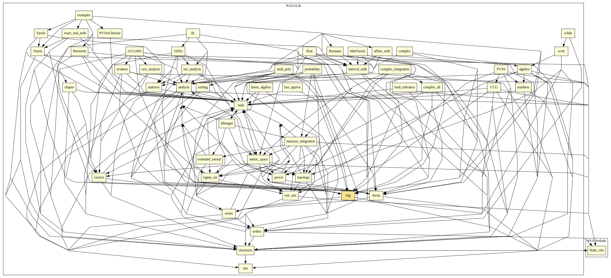

# trig

A Foundational Theory of Trigonometry, providing definitions, identities, approximations.

## Highlights

### Major theorems

| Theorem | Location | PVS Name | Contributors |
| --- | --- | --- | --- |
|Law of Cosines  |`trig@law_cosines`|`Law_Cosines`| César Muñoz |
|Trig Identities: Double Angle Formulas |`trig@rig_basic`|`sin2a, cos2s`| David Lester |
|Pythagorean Property - Sine and Cosine |`trig@trig_basic`|`sin2_cos2`| David Lester |
|Trig Identities: Sum and Diff of Two Angles |`trig@trig_basic`|`sin_plus`| David Lester |

# Contributors
* [César Muñoz](http://shemesh.larc.nasa.gov/people/cam), NASA, USA
* [Víctor Carreño](http://shemesh.larc.nasa.gov/people/vac), NASA, USA
* [Ricky Butler](http://shemesh.larc.nasa.gov/people/rwb), NASA, USA
* [Gilles Dowek](https://who.rocq.inria.fr/Gilles.Dowek/index-en.html), INRIA, France
* Alfons Geser, HTWK Leipzig, Germany
* [Ben Di Vito](http://shemesh.larc.nasa.gov/people/bld), NASA, USA
* [David Lester](http://apt.cs.man.ac.uk/people/dlester), Manchester University, UK
* John Siratt, University of Arkansas at Little Rock, USA
* Anthony Narkawicz, NASA, USA
* Radu Siminiceanu, NIA, USA
* [Mariano Moscato](https://www.nianet.org/directory/research-staff/mariano-moscato/), NIA & NASA, USA
* [Sam Owre](http://www.csl.sri.com/users/owre), SRI, USA

## Maintainer
* [César Muñoz](http://shemesh.larc.nasa.gov/people/cam), NASA, USA

# Dependencies

