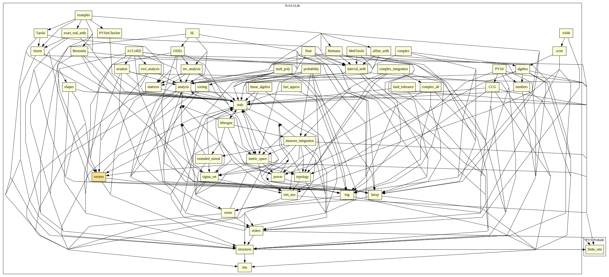

# Vectors

2-D, 3-D, 4-D, and n-dimensional vectors.

## Highlights

### Major theorems

| Theorem | Location | PVS Name | Contributors |
| --- | --- | --- | --- |
|Cauchy-Schwarz Inequality  |`vectors@vectors`|`cauchy_schwartz`| Ricky Butler |

# Contributors
* Anthony Narkawicz, NASA, USA
* [Ben Di Vito](http://shemesh.larc.nasa.gov/people/bld), NASA, USA
* [César Muñoz](http://shemesh.larc.nasa.gov/people/cam), NASA, USA
* [George Hagen](http://shemesh.larc.nasa.gov/people/geh), NASA, USA
* [Paul Miner](http://shemesh.larc.nasa.gov/people/psm), NASA, USA
* [Ricky Butler](http://shemesh.larc.nasa.gov/people/rwb), NASA, USA
* [Jeff Maddalon](http://shemesh.larc.nasa.gov/people/jmm), NASA, USA
* Hanne Gottliebsen, NIA, USA
* [Mariano Moscato](https://www.nianet.org/directory/research-staff/mariano-moscato/), NIA & NASA, USA
* [Sam Owre](http://www.csl.sri.com/users/owre), SRI, USA

## Maintainer
* [César Muñoz](http://shemesh.larc.nasa.gov/people/cam), NASA, USA

# Dependencies

